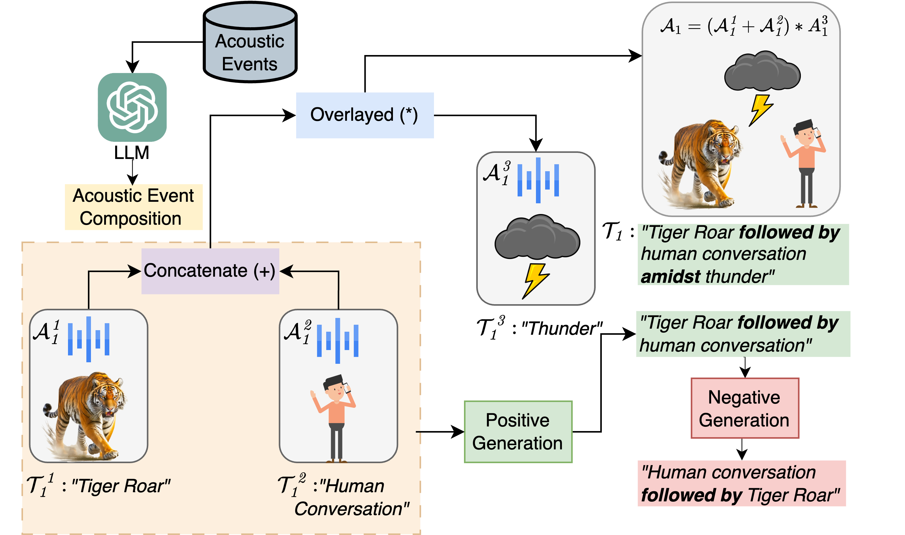

<div style="display: flex; align-items: center;">
  <h1>Template-based synthetic creation of audio-caption pairs</h1>
</div>

---
In **Template-based synthetic creation of audio-caption pairs** we employ a modular template-based approach to create compositional audios and their captions from single acoustic events and their labels (which are abundantly and easily available). Then, we align each audio in the batch with positive captions of various granularity and generate hard negatives with different compositions, which allows the model to focus on fine-grained compositional relationships in the audio.

<div align="center">

</div>

## Usage
We use AudioSet Strong for audio mixing. Please find the format for the audioset files used for mixing in `./data/`.
1. Firstly, based on acoustic similarities, we group the audioset strong labels into various subcategories such as `['animal soung', 'vechile sound', ...]` (You can find the categories used in the paper in `./data/global_sound.yml`)

2. Next, we utilize these sublabels to construct **audio mixing expressions**, for example: `('Bird sounds' + 'Nature sound') * ('Land Animal sounds' + 'Human Speech')`, where `+` and `*` are the symbols used for **concatenation** and **overlay** between two audio respectively. We use GPT-4 to generate these expressions. Please find the prompt used for expression generation and the expression used for the experiments in `./data/prompt_audio_gen.txt` and `./data/expression.txt`

3. Finally, run the `mix_audio.py` file:
```Shell
python mix_audio.py \
    --random_sample 'Sample rate for random sampling' \
    --out_dir 'Output directory for mixed audio data' \
    --input_dir 'List of input directories containing audio files' \
    --max_audio 'Maximum number of audio files to generate' \
    --global_label_path 'path to the sublabels for audioset strong' \
    --expression_path 'Path to the expression file' \
    --train_tsv_file 'Path to the original audioset strong tsv' \
    --label_tsv_file 'Path to the audioset label TSV file' \
    --out_csv 'Path to the label TSV file'
```
4. The output csv generated by the code and used for CompA training can be found here: [here](https://drive.google.com/file/d/1QP5WKp3Xx9EBsVBscYKC-IzlS249V1UT/view?usp=sharing)
5. Next, run `pos-neg-generation.py` file:
```Shell
python pos-neg-generation.py \
    --audio 'csv file obtained from mix_audio.py' \
    --sound_class  './data/global_sound.yml'
```
